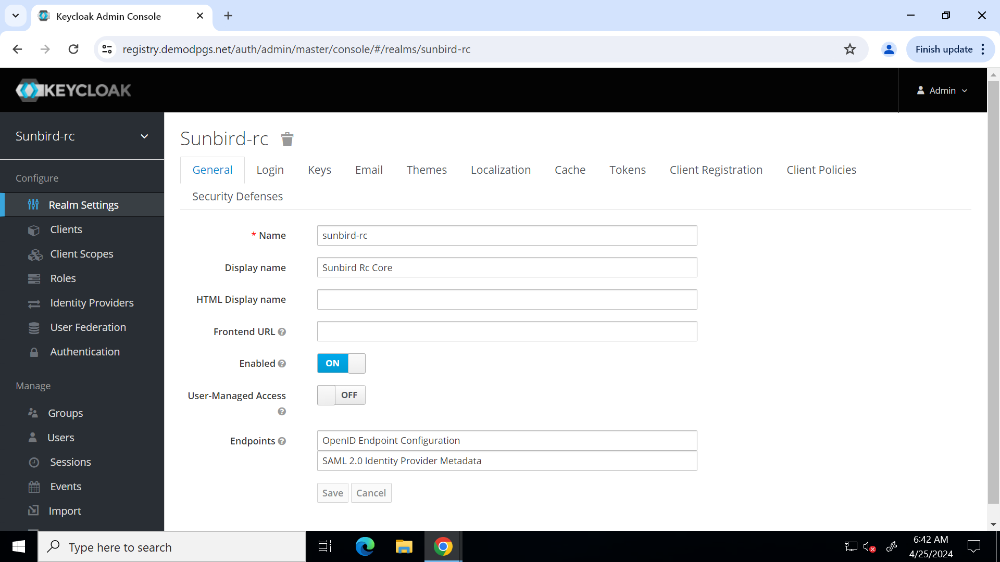

# Post Installation Steps

## Project Setup and Keycloak Configuration

This README provides instructions for verifying EKS cluster including pod, deployment and services. It also includes steps for configuring Keycloak after its installation and generate the admin client credentials to run registy service.

### 1. Check Pod and Service Status

Ensure all pods are running except registry pod and check the service status in your specified namespace.

```bash
kubectl get pods -n <namespace>


kubectl get deployments -n <namespace>

# Copy load-balancer endpoint from admin UI and Keycloak services
kubectl get svc -n <namespace>

```


### 2. Configure Keycloak service

The keycloak service will be available in  https://<SUNBIRD_RC2_HOSTNAME>/auth. Follow the below steps to complete the post installation setup.

1. [Import keycloak realm](https://github.com/Sunbird-RC/devops/tree/main/deploy-as-code/helm/v2/registryAndCredentialling#import-keycloak-realm)

2. [Configure keycloak secret](https://github.com/Sunbird-RC/devops/tree/main/deploy-as-code/helm/v2/registryAndCredentialling#configure-keycloak-secret)

### Configuration Complete
Once you've these steps, your Keycloak instance is configured as required. Ensure that the URLs and settings match your specific deployment and use case. Enjoy using Keycloak for your project and begin using Sunbird RC 2.0 Swagger UI.

- Keycloak portal will be accessible at https://<SUNBIRD_RC2_HOSTNAME>/auth


- Sunbird RC 2. 0 registry api portal will be accessible at https://<SUNBIRD_RC2_HOSTNAME>/swagger-ui.html
